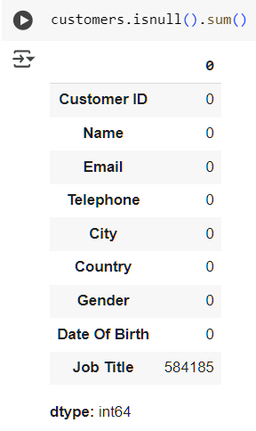
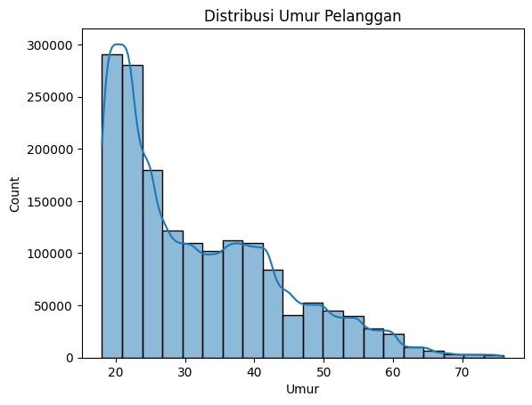
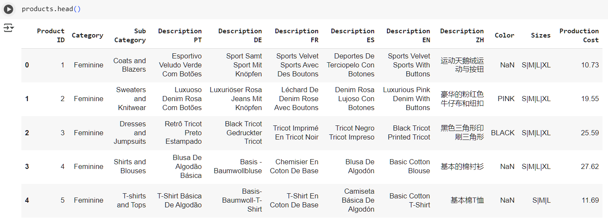
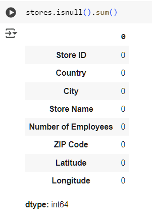
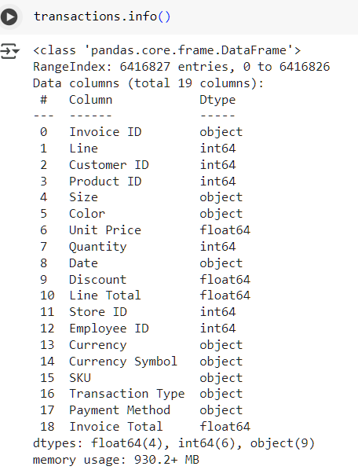
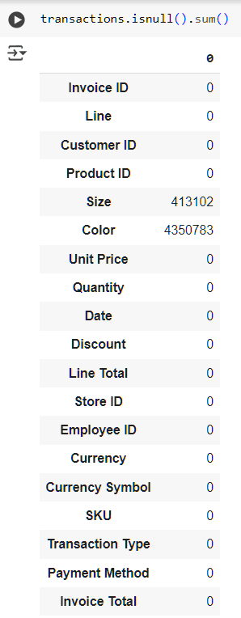
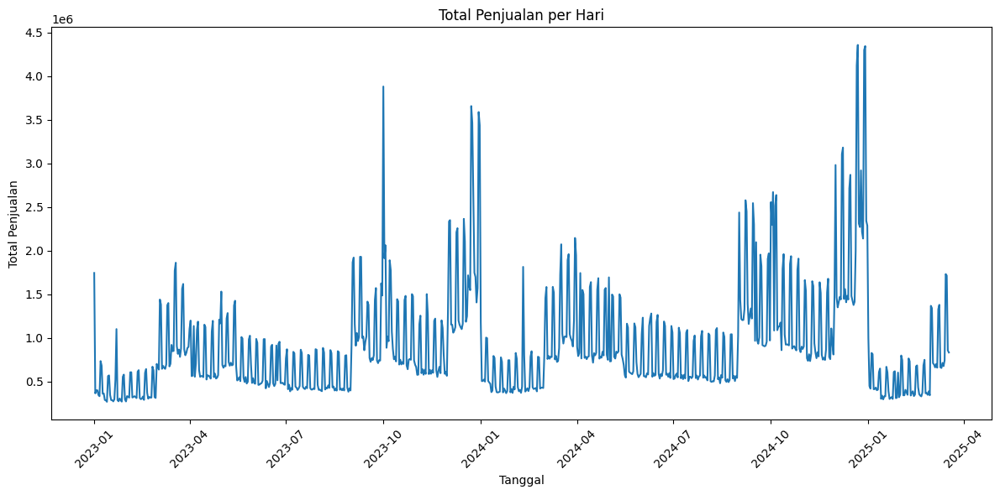
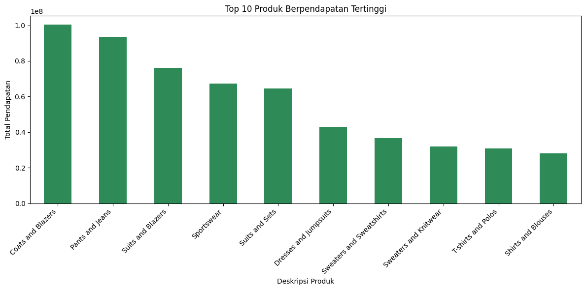

# **Laporan Proyek Machine Learning Terapan Recommendation System - Wiefran Varenzo**

## **Project Overview**


Industri fesyen global merupakan salah satu sektor dengan tingkat kompetisi yang sangat tinggi dan perkembangan yang sangat pesat. Dalam era digital saat ini, toko retail fashion dan platform e-commerce menghadapi tantangan untuk memberikan pengalaman belanja yang personal dan relevan bagi konsumen. Salah satu solusi yang terbukti efektif dalam menjawab tantangan tersebut adalah implementasi sistem rekomendasi (*recommender system*), yang secara otomatis menyarankan produk atau layanan berdasarkan preferensi dan perilaku pengguna.

Sistem rekomendasi memainkan peran penting dalam meningkatkan pengalaman pengguna sekaligus memperkuat loyalitas pelanggan serta memperbesar nilai transaksi. Dalam sebuah analisis klasik mengenai agen rekomendasi e-commerce yang ditulis oleh **Schafer, Konstan, dan Riedl (2001)** berjudul **[*E-Commerce Recommendation Agents*](https://link.springer.com/article/10.1023/A:1009804230409)**, telah lama disorot bagaimana sistem ini secara efektif dapat meningkatkan penjualan melalui *cross-selling* dan *up-selling*, membantu pengguna menemukan produk yang relevan di tengah banyaknya pilihan, yang pada akhirnya meningkatkan konversi dan loyalitas pelanggan. Studi tersebut juga menggarisbawahi bagaimana personalisasi yang didorong oleh agen rekomendasi menjadi strategi kunci untuk meningkatkan pengalaman pengguna dan mencapai keunggulan kompetitif dalam pasar digital.

Selain itu, **Ricci, Rokach, dan Shapira (2015)** dalam buku mereka yang berjudul **[*Recommender Systems Handbook*](https://doi.org/10.1007/978-1-4899-7637-6)** menjelaskan bahwa sistem rekomendasi telah berkembang menjadi bagian integral dari banyak platform digital, termasuk industri retail fashion, karena kemampuannya dalam membantu pengguna menavigasi pilihan produk yang sangat luas dan beragam secara lebih efisien. Mereka juga menekankan pentingnya penggabungan berbagai pendekatan seperti *content-based filtering* dan *collaborative filtering* untuk mencapai hasil rekomendasi yang lebih akurat dan kontekstual.

Proyek ini bertujuan untuk mengembangkan sistem rekomendasi bagi toko retail fashion dan platform e-commerce menggunakan pendekatan *content-based filtering* dan *collaborative filtering*. Sumber data yang digunakan adalah *Global Fashion Retail Stores Dataset*, yang berisi lebih dari 4 juta data toko fashion dari berbagai negara dan brand. Meskipun dataset ini tidak menyertakan data transaksi pengguna secara langsung, pendekatan berbasis konten dapat digunakan untuk menganalisis kemiripan antara toko atau brand berdasarkan atribut seperti lokasi, nama brand, dan jenis toko, sementara pendekatan kolaboratif dapat dibangun berdasarkan matriks interaksi pengguna-item yang disimulasikan dari preferensi atau kunjungan.

Model *content-based* yang digunakan dalam proyek ini memanfaatkan teknik TF-IDF dan *Latent Semantic Analysis* (LSA) untuk merepresentasikan fitur-fitur deskriptif dari brand atau lokasi toko, sedangkan model *collaborative filtering* dibangun menggunakan pendekatan *deep learning* melalui arsitektur RecommenderNet, serta model berbasis *matrix factorization* menggunakan *dot product* antara *embedding* pengguna dan item. Gabungan dua pendekatan ini diharapkan menghasilkan sistem rekomendasi yang mampu beradaptasi terhadap kebutuhan bisnis serta memberikan nilai tambah pada pengalaman pengguna.


## **Business Understanding**

Dalam industri ritel fashion, keberhasilan bisnis tidak hanya ditentukan oleh kualitas produk, tetapi juga oleh seberapa baik perusahaan memahami preferensi pelanggan dan memberikan pengalaman belanja yang relevan. Dengan semakin berkembangnya platform e-commerce dan bertambahnya jumlah pilihan produk, konsumen kini dihadapkan pada tantangan *choice overload*, di mana terlalu banyak pilihan justru dapat menghambat proses pengambilan keputusan. Hal ini menjadi alasan utama mengapa sistem rekomendasi sangat dibutuhkan, khususnya dalam sektor ritel fashion yang memiliki variasi produk yang sangat besar dan tren yang cepat berubah.

### Problem Statements

1. **Bagaimana toko retail fashion atau platform e-commerce dapat merekomendasikan jenis toko atau brand fashion yang relevan berdasarkan kesamaan atribut dan preferensi pelanggan?**
   
   Dalam dunia fashion, konsumen sering kali memiliki preferensi tertentu terhadap gaya, lokasi, atau brand. Namun, tanpa sistem rekomendasi yang terintegrasi, proses menemukan toko yang sesuai menjadi tidak efisien dan membingungkan. Hal ini mengurangi pengalaman pengguna dan menurunkan kemungkinan konversi penjualan.

2. **Bagaimana sistem dapat memberikan rekomendasi secara otomatis berdasarkan kesamaan pelanggan lain yang memiliki preferensi serupa (collaborative filtering)?**
   
   Platform fashion sering kali tidak memanfaatkan data historis perilaku pelanggan untuk menemukan pola pembelian atau preferensi yang bisa dimanfaatkan untuk memberikan rekomendasi yang lebih personal. Tanpa pendekatan kolaboratif, rekomendasi bersifat generik dan tidak memanfaatkan kekuatan komunitas pengguna.

3. **Bagaimana membuat dua pendekatan sistem rekomendasi , content-based dan collaborative filtering , untuk menciptakan sistem yang lebih akurat, responsif, dan adaptif terhadap kebutuhan bisnis fashion?**
   Sering kali sistem rekomendasi hanya mengandalkan satu pendekatan, padahal masing-masing metode memiliki kekuatan dan kelemahan. Content-based cocok untuk rekomendasi berbasis deskripsi produk, sementara collaborative filtering efektif untuk menemukan pola dari preferensi pengguna lain. Kombinasi keduanya dapat meningkatkan performa sistem.

---

### Goals

1. **Membangun sistem rekomendasi berbasis konten untuk menyarankan toko fashion yang memiliki kesamaan atribut dengan preferensi pengguna.**
   
   Tujuan ini akan dijawab dengan memanfaatkan fitur-fitur seperti nama toko, brand, kategori, dan lokasi toko dari dataset, lalu menerapkan teknik seperti TF-IDF dan *cosine similarity* untuk mengukur kemiripan antar entitas.

2. **Mengembangkan sistem rekomendasi berbasis collaborative filtering yang mampu mengidentifikasi pola rekomendasi berdasarkan preferensi pengguna lain yang serupa.**
   
   Untuk tujuan ini, akan digunakan pendekatan berbasis deep learning dan matrix factorization untuk membangun hubungan antara pengguna dan item secara implisit, berdasarkan interaksi simulasi atau pembobotan preferensi.

3. **Menciptakan dua pendekatan yaitu Content-based dan collaborative yang dapat diaplikasikan, akurat, responsif, dan adaptif terhadap kebutuhan bisnis fashion.**

    Penciptaan kedua pendekatan ini bertujuan agar sistem mampu memberikan rekomendasi secara lebih menyeluruh,  baik berdasarkan deskripsi konten maupun perilaku komunitas , sehingga menghasilkan saran yang lebih personal dan relevan bagi pengguna.

---

### Solution Approach

Untuk mencapai tujuan tersebut, berikut dua pendekatan utama yang diimplementasikan dalam proyek ini:

#### Solution 1: **Content-Based Filtering**

Pendekatan ini bertujuan merekomendasikan toko atau brand fashion berdasarkan atribut yang mirip dengan preferensi pengguna. Langkah-langkah yang dilakukan:

* **Ekstraksi Fitur**: Mengambil informasi seperti `Brand`, `Country`, `Category`, dan `Name` dari dataset.
* **Representasi Teks**: Menggunakan teknik TF-IDF (Term Frequency-Inverse Document Frequency) untuk mengubah deskripsi teks menjadi vektor numerik.
* **Dimensionality Reduction**: Diterapkan *Truncated SVD* (Latent Semantic Analysis) untuk mengurangi dimensi dan menangkap semantik dari fitur teks.
* **Pengukuran Kemiripan**: Menggunakan *cosine similarity* untuk mengukur tingkat kemiripan antara satu toko dengan toko lainnya.
* **Output**: Daftar rekomendasi toko yang paling mirip dengan preferensi pengguna atau toko tertentu.

#### Solution 2: **Collaborative Filtering**

Pendekatan ini menggunakan pola perilaku pengguna (interaksi, preferensi, atau pembelian yang disimulasikan) untuk memberikan rekomendasi berdasarkan kesamaan perilaku antar pengguna.

* **Simulasi Interaksi**: Karena dataset tidak memiliki data interaksi pengguna, pendekatan ini mensimulasikan interaksi berdasarkan asumsi atau sintesis data pengguna fiktif berdasarkan tren atau popularitas.
* **Matrix Factorization**: Menggunakan teknik embedding untuk merepresentasikan user dan item dalam bentuk vektor laten.
* **Model Deep Learning (RecommenderNet)**: Arsitektur neural network yang mengkombinasikan embedding layers untuk user dan item, diikuti dengan dense layers dan fungsi aktivasi untuk memprediksi relevansi item terhadap pengguna.
* **Output**: Rekomendasi brand atau toko untuk setiap pengguna berdasarkan kedekatan representasi vektor.

## **Data Understanding**

Dataset yang digunakan dalam proyek ini berjudul **"Global Fashion Retail Sales"**, yang diambil dari [Kaggle Repository](https://www.kaggle.com/datasets/ricgomes/global-fashion-retail-stores-dataset?select=transactions.csv). Dataset ini terdiri dari data penjualan global dari sebuah perusahaan fashion retail dan mencakup berbagai aspek penting seperti transaksi, pelanggan, produk, dan toko.

Secara keseluruhan, dataset ini terbagi menjadi **empat subset utama**, yaitu:

1. **Sales Transaction Dataset** (data transaksi)
2. **Customer Dataset** (data pelanggan)
3. **Product Dataset** (data produk)
4. **Store Dataset** (data toko)

### **Kondisi dan Kuantitas Data**

Dataset mencakup 4540404 data baris transaksi (Berdasarkan Invoice), lalu total ada 6,416,827 baris data di dataset transaksi (ini bisa dilihat dari transactions.info()), kemudian terdapat  17940 data produk, 35 data toko, hingga 1,64 juta data pelanggan dari berbagai negara yang disimpan pada dataset yang berbeda-beda. Seluruh data tampak cukup bersih dan cukup terstruktur, dengan tipe data yang relevan dan lengkap untuk keperluan eksplorasi serta pemodelan sistem rekomendasi. Namun, beberapa kolom seperti `Sizes` dan `Color` di dataset transactions yang memiliki nilai kosong yang perlu diproses di tahap data preparation. Data transaksi memiliki format `datetime`, numerik (`float`, `int`), dan kategorikal, yang dapat dimanfaatkan dalam berbagai teknik eksplorasi dan rekomendasi. Informasi yang tersedia tetap dapat dimanfaatkan untuk membangun sistem rekomendasi berbasis konten dan simulasi interaksi pelanggan.


---
### **Deskripsi Variabel dan Atribut**

#### **1. Transaksi (Sales Transaction Dataset)**

| Kolom            | Deskripsi                                           | Tipe Data       |
| ---------------- | --------------------------------------------------- | --------------- |
| Invoice ID       | ID unik untuk transaksi                             | `string`        |
| Line             | Nomor urut item dalam invoice                       | `int`           |
| Customer ID      | ID unik pelanggan                                   | `string`        |
| Product ID       | ID unik produk                                      | `string`        |
| Size             | Ukuran produk (S, M, L, XL, atau kosong)            | `string / null` |
| Color            | Warna produk (versi transaksi)                      | `string`        |
| Unit Price       | Harga satuan produk sebelum diskon                  | `float`         |
| Quantity         | Jumlah unit dibeli                                  | `int`           |
| Date             | Tanggal dan waktu transaksi                         | `datetime`      |
| Discount         | Diskon (misalnya 0.2 berarti 20%)                   | `float`         |
| Line Total       | Total harga line item setelah diskon                | `float`         |
| Store ID         | ID toko tempat transaksi                            | `string`        |
| Employee ID      | ID karyawan yang memproses transaksi                | `string`        |
| Currency         | Kode mata uang (3 huruf)                            | `string`        |
| Currency Symbol  | Simbol mata uang                                    | `string`        |
| SKU              | Gabungan Product ID, Size, dan Color                | `string`        |
| Transaction Type | Jenis transaksi (Sale, Return)                      | `category`      |
| Payment Method   | Metode pembayaran                                   | `category`      |
| Invoice Total    | Total invoice (sama untuk setiap baris per invoice) | `float`         |


#### **2. Pelanggan (Customer Dataset)**

| Kolom         | Deskripsi               | Tipe Data  |
| ------------- | ----------------------- | ---------- |
| Customer ID   | ID unik pelanggan       | `string`   |
| Name          | Nama pelanggan          | `string`   |
| Email         | Email pelanggan         | `string`   |
| Telephone     | Nomor telepon pelanggan | `string`   |
| City          | Kota pelanggan          | `string`   |
| Country       | Negara pelanggan        | `string`   |
| Gender        | Jenis kelamin (F, M, D) | `category` |
| Date Of Birth | Tanggal lahir pelanggan | `date`     |
| Job Title     | Pekerjaan pelanggan     | `string`   |
| Age           | Umur pelanggan          | `int`      |

#### **3. Produk (Product Dataset)**

| Kolom           | Deskripsi                   | Tipe Data      |
| --------------- | --------------------------- | -------------- |
| Product ID      | ID unik produk              | `string`       |
| Category        | Kategori produk utama       | `string`       |
| Sub Category    | Subkategori produk          | `string`       |
| Description PT  | Deskripsi produk (Portugis) | `string`       |
| Description DE  | Deskripsi produk (Jerman)   | `string`       |
| Description FR  | Deskripsi produk (Perancis) | `string`       |
| Description ES  | Deskripsi produk (Spanyol)  | `string`       |
| Description EN  | Deskripsi produk (Inggris)  | `string`       |
| Description ZH  | Deskripsi produk (Mandarin) | `string`       |
| Color           | Warna produk (versi produk) | `string`       |
| Sizes           | Ukuran produk yang tersedia | `list<string>` |
| Production Cost | Biaya produksi dalam USD    | `float`        |

#### **4. Toko (Store Dataset)**

| Kolom               | Deskripsi                        | Tipe Data |
| ------------------- | -------------------------------- | --------- |
| Store ID            | ID toko                          | `string`  |
| Store Name          | Nama toko                        | `string`  |
| Number of Employees | Jumlah karyawan di toko          | `int`     |
| ZIP Code            | Kode pos toko                    | `string`  |
| City                | Kota toko                        | `string`  |
| Country             | Negara toko                      | `string`  |
| Latitude            | Koordinat lintang toko           | `float`   |
| Longitude           | Koordinat bujur toko             | `float`   |
| Country\_English    | Nama negara dalam bahasa Inggris | `string`  |

---

### **Exploratory Data Analysis**

#### **Customer Dataset**

1. **Preview dan Struktur Data Pelanggan**

   Untuk memahami struktur awal, digunakan `customers.head()` untuk menampilkan beberapa baris pertama data pelanggan:

   >

   Dari hasil preview, terlihat bahwa data pelanggan memiliki informasi seperti `Customer ID`, `Gender`, 

2. **Informasi Kolom dan Tipe Data**

    `Date Of Birth`, dan lainnya.
    ``` python
    print('Jumlah data pelanggan: ', len(customers['Customer ID'].unique()))
    ```
    Jumlah unik pelanggan dihitung dengan:

    > Jumlah data pelanggan: 1,643,306
   >

   Dapat disimpulkan bahwa kolom memiliki tipe data yang sesuai, meskipun perlu penyesuaian pada `Date Of Birth` agar bertipe datetime. Lalu bisa kita lihat terdapat perbedaan atau ketidak-samaan untuk jumlah data Job Title dibandingkan kolom lainnya.

3. **Pemeriksaan Nilai Kosong dan Duplikat**

   > 

   Ditemukan 584185 data null pada dataset pelanggan lebih tepatnya di kolom Job Title.

    ```python
    customers.duplicated().sum()
    ```

   Terdapat 0 data duplikat:

   > `np.int64(0)`

4. **Pemrosesan Kolom Tanggal dan Usia Pelanggan**
    
    ```python
    # Memastikan kolom Date Of Birth menjadi date
    customers['Date Of Birth'] = pd.to_datetime(customers['Date Of Birth'], errors='coerce')

    # Hitung usia (Age)
    today = pd.to_datetime('today')
    customers['Age'] = customers['Date Of Birth'].apply(lambda dob: (today.year - dob.year - ((today.month, today.day) < (dob.month, dob.day))) if pd.notnull(dob) else None)
    ```
   Kolom `Date Of Birth` dikonversi menjadi datetime, lalu dihitung kolom baru `Age`. Distribusi umur divisualisasikan sebagai berikut:

   > 

   Mayoritas pelanggan berada pada rentang usia produktif antara 20–40 tahun.

5. **Distribusi Gender Pelanggan**

   > 

   Tampak distribusi pelanggan berdasarkan gender cukup timpang, dimana Male adalah gender customer yang paling banyak ditemui.
---

#### **Product Dataset**

1. **Preview Data Produk**

   > 

   Produk memiliki atribut seperti `Product ID`, `Sub Category`, `Category`, `Sizes`, ``Production Cost`, serta berbagai deskrispi dalam berbagai bahasa negara yang cocok untuk kita gunakan.

2. **Jumlah dan Variasi Sub-Kategori**

   Jumlah Sub Kategori: 21, 
   
   Berikut adalah Sub Categori yang didapat:
    | No. | Sub Kategori                        | No. | Sub Kategori                         |
    |-----|-------------------------------------|-----|--------------------------------------|
    | 1   | Coats and Blazers                   | 12  | Sweaters and Sweatshirts             |
    | 2   | Sweaters and Knitwear               | 13  | T-shirts and Polos                   |
    | 3   | Dresses and Jumpsuits               | 14  | Shirts                               |
    | 4   | Shirts and Blouses                  | 15  | Suits and Blazers                    |
    | 5   | T-shirts and Tops                   | 16  | Underwear and Pajamas                |
    | 6   | Pants and Jeans                     | 17  | Baby (0-12 months)                   |
    | 7   | Skirts and Shorts                   | 18  | Girl and Boy (1-5 years, 6-14 years) |
    | 8   | Suits and Sets                      | 19  | Coats                                |
    | 9   | Sportswear                          | 20  | Sweaters                             |
    | 10  | Lingerie and Pajamas                | 21  | Pajamas                              |
    | 11  | Accessories                         |     |                                      |


3. **Informasi Tipe Data Produk**

   > 

   Seluruh kolom memiliki tipe data yang sesuai, namun terdapat perbedaan jumlah di Sizes dan juga Color. Hal ini bisa mengindikasikan adanya null atau memang mereka ada yang duplikat.

4. **Pemeriksaan Nilai Kosong dan Duplikat**

   > 

   Ditemukan 12445 data null pada kolom Color dan 2070 data null pada kolom sizes di dataset product.

    ```python
    products.duplicated().sum()
    ```

   Terdapat 0 data duplikat:

   > `np.int64(0)`


5. **Distribusi Kategori dan Sub-Kategori**

   > 

   Terlihat bahwa feminime adalah kategori mendominasi penjualan, diikuti oleh Masculine dan children. Namun perbedaan tidak terlalu jauh.

   > 

   Sub-kategori sangat bervariasi, menunjukkan diversifikasi produk yang tinggi. Sub Kategori produk yang paling banyak ditemukan adalah Accesories, lalu diikut oleh Pants and jeans, Sportwear, dan coats and Blazers, untuk sub categori lainnya jumlah sama di sekitar 700 produk.

---

#### **Store Dataset**

1. **Preview Data Toko**

   > 

   Informasi toko mencakup `Store Name`, `Country`, City`, dan lokasi serta data lainnya berkaitan dengan informasi toko retail yang telah di data.

2. **Jumlah Toko Unik**

   Terdapat beberapa nama toko unik yang tersebar di berbagai negara.
   Terdiri dari 35 data toko unik.
   | No. | Nama Toko             | No. | Nama Toko               |
    |-----|-----------------------|-----|--------------------------|
    | 1   | Store New York        | 19  | Store Liverpool          |
    | 2   | Store Los Angeles     | 20  | Store Bristol            |
    | 3   | Store Chicago         | 21  | Store Paris              |
    | 4   | Store Houston         | 22  | Store Marseille          |
    | 5   | Store Phoenix         | 23  | Store Lyon               |
    | 6   | Store 上海             | 24  | Store Toulouse           |
    | 7   | Store 北京             | 25  | Store Nice               |
    | 8   | Store 广州             | 26  | Store Madrid             |
    | 9   | Store 深圳             | 27  | Store Barcelona          |
    | 10  | Store 重庆             | 28  | Store Valencia           |
    | 11  | Store Berlin          | 29  | Store Sevilla            |
    | 12  | Store Hamburg         | 30  | Store Zaragoza           |
    | 13  | Store München         | 31  | Store Lisboa             |
    | 14  | Store Köln            | 32  | Store Porto              |
    | 15  | Store Frankfurt am Main | 33 | Store Braga              |
    | 16  | Store London          | 34  | Store Guimarães          |
    | 17  | Store Birmingham      | 35  | Store Coimbra            |
    | 18  | Store Glasgow         |     |                          |

3. **Pemeriksaan Nilai Kosong dan Duplikat**

   > 

   Ditemukan 0 data null di dataset stores.

    ```python
    stores.duplicated().sum()
    ```

   Terdapat 0 data duplikat di dataset stores:

   > `np.int64(0)`

4. **Pemetaan dan Visualisasi Negara**

   Setelah memetakan nama negara ke karakter Latin:

   > 

   Semua negara memiliki nilai yang sama yaitu memiliki masing-masing 5 toko retail fashion yang telah di data.

---

#### **Transaction Dataset**

1. **Jumlah dan Informasi Transaksi**
    
    Ini adalah dataset transaksi yang telah dilakukan oleh customer, yang dimana dataset inilah inti dari seluruh analisa data untuk pembuatan sistem rekomendasi

   > 
   >

   ```python
   print('Jumlah data transaksi: ', len(transactions['Invoice ID'].unique()))
   ```
   > Jumlah data transaksi:  4540404

   Untuk setiap tipe data tidak ada yang aneh, serta bisa kita lihat bahwa di dataset ini berhubungan (foreign key) terhadap ID di dataset lainnya, hal ini bisa kita gunakan untuk melakukan merge data.

2. **Pemeriksaan Nilai Kosong dan Duplikat**

   > 
   Ditemukan 413102 data null di kolom size, dan 4350783 di kolom Color dataset transactions.

    ```python
    transactions.duplicated().sum()
    ```

   Terdapat 798 data duplikat di dataset transactions:

   > `np.int64(798)`

3. **Distribusi Metode Pembayaran**

   > 

   Metode pembayaran dengan frekuensi tertinggi menunjukkan preferensi pelanggan terhadap metode tertentu. Bisa kita lihat kalau yang paling sering digunakan oleh pelanggan adalah Credit Card

4. **Distribusi Tipe Transaksi**

   > 

   Mayoritas transaksi merupakan pembelian, dengan sebagian kecil berupa pengembalian.

5. **Tren Penjualan Harian**

   > 

   Penjualan harian menunjukkan fluktuasi musiman dengan beberapa puncak penjualan tertentu. Seperti di Akhir tahun yang memiliki lonjakan cukup tinggi karena adanya natal dan tahun baru.

6. **Korelasi antar Fitur Numerik Transaksi**

   > 

   Unit Price memiliki korelasi positif kuat dengan Line Total dan Invoice Total, yang menunjukkan bahwa semakin tinggi harga satuan, semakin besar nilai total transaksi, terutama jika jumlah dan diskon relatif stabil.

7. **Top Produk Berdasarkan Jumlah Terjual**

   > 

   Produk dari sub-kategori tertentu mendominasi penjualan, seperti hal nya , Sportswear, dan Coat & Blazer memiliki top 3 produk terlaris

8. **Top Produk Berdasarkan Pendapatan**

   > 

   Produk dengan harga tinggi dan volume penjualan besar memberikan kontribusi pendapatan tertinggi. Seperti halnya Coat & Blazer, tetapi untuk suits and blazers cukup menarik kalau dilihat, sebab walaupun bukan produk terlaris, tetapi dia termasuk pada top 3 produk yang berkontribusi pada pendapatan.

---

### **Kesimpulan EDA**

Dataset mencakup informasi lengkap tentang produk, toko, dan transaksi retail fashion. Terdapat 21 sub-kategori produk dengan variasi tinggi, di mana Accessories, Pants and Jeans, dan Sportswear paling umum. Kategori Feminine mendominasi jumlah produk.

Data toko terdiri dari 35 toko unik yang tersebar merata di berbagai negara besar, masing-masing negara memiliki 5 toko.

Dataset transaksi berisi lebih dari 4,5 juta data, dengan mayoritas berupa pembelian dan metode pembayaran terbanyak adalah kartu kredit. Tren penjualan menunjukkan lonjakan signifikan di akhir tahun. Produk dengan unit price tinggi cenderung menghasilkan line total dan invoice total lebih besar. Produk terlaris berasal dari sub-kategori Sportswear dan Coats & Blazers, sedangkan Suits and Blazers memberikan pendapatan besar meski tidak paling laku.

Namun masih ada beberapa hal yang harus diperhatikan, seperti:
* Masih ditemukan data null yang perlu dibersihkan
* Ada kolom yang masih memiliki tipe data yang salah, sehingga harus diubah
* Date Of Birth lebih baik diubah menjadi Age sehingga lebih mudah untuk dibaca.

---

## **Data Preparation**

Pada tahap ini, dilakukan serangkaian teknik pembersihan dan pemrosesan data untuk memastikan dataset bersih, konsisten, dan siap digunakan dalam modeling sistem rekomendasi berbasis **Content-Based Filtering (CBF)** dan **Collaborative Filtering (CF)**. Berikut penjelasan lengkap setiap tahapan secara berurutan yang dimulai dari pembersihan data (Preprocessing):

### 1. **Menghapus Nilai Kosong (Null) dan Data Duplikat**

    ```python
    customers = customers.dropna(axis=0, how='any').drop_duplicates()
    products = products.dropna(axis=0, how='any').drop_duplicates()
    stores = stores.dropna(axis=0, how='any').drop_duplicates()
    transactions = transactions.dropna(axis=0, how='any').drop_duplicates()
    ```

**Penjelasan:**
Setiap dataset (`customers`, `products`, `stores`, `transactions`) dibersihkan dengan menghapus baris yang memiliki nilai kosong (`dropna`) dan kemudian dihapus data duplikatnya (`drop_duplicates`).

**Alasan:**
- Missing value dapat menyebabkan error saat proses join/merge.
- Data duplikat bisa menyebabkan bias pada analisis dan model, misalnya membuat suatu produk tampak lebih populer dari sebenarnya.
- Dataset cukup besar sehingga penghapusan tidak berdampak signifikan pada informasi keseluruhan.

---

### 2. **Menggabungkan Keempat Dataset**

```python
df = transactions.merge(customers, on='Customer ID', how='inner') \
                 .merge(products, on='Product ID', how='inner') \
                 .merge(stores, on='Store ID', how='inner')
```

**Penjelasan:**
Dataset transaksi digabung dengan data pelanggan, produk, dan toko menggunakan `Customer ID`, `Product ID`, dan `Store ID` secara berturut-turut melalui metode `inner join`.

**Alasan:**
Proses ini menyatukan semua informasi penting dalam satu dataframe (`df`) agar siap digunakan untuk analisis dan pemodelan, baik berdasarkan interaksi pengguna maupun konten produk.

---

### 3. **Memeriksa Hasil Penggabungan**

```python
print(df.info())
print(df.isnull().sum())
```

**Penjelasan:**
Setelah penggabungan, dilakukan pengecekan struktur data (`info()`) dan keberadaan nilai null (`isnull().sum()`).

**Hasil:**
Tidak ditemukan nilai null pada dataset gabungan. Seluruh data sudah bersih dan siap diproses lebih lanjut.

---
**Persiapan data Content-Based Filtering**
---

### 4. **Memilih Kolom Relevan untuk Content-Based Filtering**

```python
df_cbf = df[['Product ID', 'Category', 'Sub Category', 'Color_y', 'Sizes', 'Description EN']].copy()
df_cbf = df_cbf.drop_duplicates(subset=['Product ID']).reset_index(drop=True)
```

**Penjelasan:**
Hanya kolom-kolom yang relevan untuk content-based filtering yang dipertahankan. Setelah itu, dilakukan penghapusan duplikat berdasarkan `Product ID`.

**Alasan:**
- Untuk CBF, hanya butuh informasi kontekstual produk seperti kategori, warna, ukuran, dan deskripsi.
- Menghindari duplikasi produk agar sistem tidak merekomendasikan item yang sama berulang kali.

---

### 5. **Gabungan Fitur dan TF-IDF Encoding**

```python
df_cbf['combined_features'] = df_cbf['Category'].astype(str) + ' ' + df_cbf['Sub Category'].astype(str) + ' ' + df_cbf['Color_y'].astype(str) + ' ' + df_cbf['Sizes'].astype(str) + ' ' + df_cbf['Description EN'].astype(str)

tfidf = TfidfVectorizer(stop_words='english')
tfidf_matrix = tfidf.fit_transform(df_cbf['combined_features'])
```

**Penjelasan:**
Fitur teks dari produk digabungkan menjadi satu kolom (`combined_features`) lalu diubah menjadi representasi numerik menggunakan **TF-IDF (Term Frequency-Inverse Document Frequency)**.

**Alasan:**
- TF-IDF membantu mengubah teks menjadi vektor yang dapat dihitung kemiripannya.
- Membantu sistem menemukan produk dengan konten mirip berdasarkan deskripsi dan fitur produk.

---
**Persiapan data Collaborative Filtering**
---

### 6. **Persiapan Data untuk Collaborative Filtering**

```python
cf_data = df[['Customer ID', 'Product ID', 'Line Total']].copy()
cf_data = cf_data[cf_data['Line Total'] > 0].copy()
```

**Penjelasan:**
Hanya kolom-kolom penting untuk collaborative filtering yang dipilih (`Customer ID`, `Product ID`, `Line Total`). Transaksi dengan `Line Total` ≤ 0 dihapus karena tidak valid.

**Alasan:**
- `Line Total` merepresentasikan kontribusi pembelian terhadap pendapatan.
- Hanya transaksi positif yang relevan untuk mengukur minat pengguna.

---

### 7. **Transformasi Logaritma Natural dan Normalisasi Rating**

```python
cf_data['rating'] = np.log1p(cf_data['Line Total'])
scaler = MinMaxScaler()
cf_data['rating'] = scaler.fit_transform(cf_data[['rating']])
```

**Penjelasan:**
Nilai `Line Total` ditransformasi menggunakan fungsi logaritma natural (`log1p`) untuk mengurangi skewness, lalu dinormalisasi ke rentang [0,1] menggunakan `MinMaxScaler`.

**Alasan:**
- Transformasi log membantu mengurangi perbedaan skala ekstrem antara produk mahal dan murah.
- Normalisasi memastikan semua rating berada dalam skala yang sama, membantu stabilitas pelatihan model.

---

### 8. **Encoding ID Pelanggan dan Produk**

```python
user_ids = cf_data['Customer ID'].unique().tolist()
product_ids = cf_data['Product ID'].unique().tolist()

user2user_encoded = {x: i for i, x in enumerate(user_ids)}
product2product_encoded = {x: i for i, x in enumerate(product_ids)}

cf_data['user'] = cf_data['Customer ID'].map(user2user_encoded)
cf_data['product'] = cf_data['Product ID'].map(product2product_encoded)
num_users = len(user2user_encoded)
num_products = len(product2product_encoded)
cf_data = cf_data[['user', 'product', 'rating']]
```

**Penjelasan:**
ID pelanggan dan produk dikonversi ke indeks numerik agar kompatibel dengan model machine learning. Hasil akhir hanya memuat kolom `user`, `product`, dan `rating`.

**Alasan:**
- Model neural network tidak menerima string sebagai input, hanya angka.
- Mapping ini memungkinkan pelatihan model menggunakan embedding layer yang efektif.

---

## **Modeling**

Untuk menyelesaikan permasalahan sistem rekomendasi dalam retail ini, digunakan dua pendekatan utama:

1. **Content-Based Filtering (CBF)**
2. **Collaborative Filtering (CF)**

Masing-masing pendekatan dilengkapi dengan **dua metode berbeda** untuk meningkatkan ketepatan dan variasi rekomendasi. Output akhir dari kedua pendekatan adalah **Top-N produk** yang direkomendasikan berdasarkan konten atau perilaku pengguna.

---

### **1. Content-Based Filtering (CBF)**

Content-Based Filtering merekomendasikan produk berdasarkan **kemiripan deskriptif antar item**. Pendekatan ini cocok untuk kasus di mana kita ingin memberikan rekomendasi produk yang mirip dengan produk yang sudah dilihat, dibeli, atau disukai oleh pengguna. CBF tidak bergantung pada data interaksi pengguna lain, sehingga dapat mengatasi masalah *cold-start user*.

Pada proyek ini, dibangun dua model collaborative filtering:

* TF-IDF + Nearest Neighbors 
* TF-IDF + LSA (Latent Semantic Analysis)

Kedua model bertujuan menghasilkan Top-N rekomendasi produk untuk pelanggan tertentu.

---

#### **Pendekatan 1: TF-IDF + Nearest Neighbors (Cosine Similarity)**

Pendekatan ini mengubah teks deskripsi produk menjadi representasi numerik menggunakan **TF-IDF**, kemudian mencari produk yang paling mirip menggunakan algoritma **Nearest Neighbors** berbasis **cosine similarity**.

```python
from sklearn.feature_extraction.text import TfidfVectorizer
from sklearn.neighbors import NearestNeighbors
```

> **Penjelasan:** TF-IDF (Term Frequency-Inverse Document Frequency) digunakan untuk mengubah data teks menjadi vektor numerik. Kata-kata yang unik akan mendapat bobot lebih tinggi, sedangkan kata-kata umum (seperti “dan”, “the”, dll.) akan dinormalisasi.

---

##### **Langkah 1: Pemetaan indeks produk**

```python
# Pemetaan ID Produk ke indeks DataFrame
product_id_to_index = pd.Series(df_cbf.index, index=df_cbf['Product ID'])
```

> **Penjelasan:** Digunakan untuk mengakses baris produk berdasarkan `Product ID` secara efisien saat melakukan pencarian rekomendasi.

---

##### **Langkah 2: Membangun model Nearest Neighbors**

```python
# Inisialisasi model Nearest Neighbors menggunakan cosine similarity
model_knn = NearestNeighbors(metric='cosine', algorithm='brute')
model_knn.fit(tfidf_matrix)
```

> **Penjelasan:** Model Nearest Neighbors digunakan untuk menemukan produk yang paling dekat berdasarkan vektor TF-IDF. Metode `cosine similarity` efektif karena mengukur sudut antar vektor, bukan panjang absolutnya, sangat cocok untuk data teks.

---

##### **Langkah 3: Fungsi rekomendasi**

```python
def get_recommendations_with_similarity(product_id, top_n=5):
    if product_id not in product_id_to_index:
        return f"Product ID {product_id} not found."
    idx = product_id_to_index[product_id]
    sim_scores = list(enumerate(cosine_similarity(tfidf_matrix[idx], tfidf_matrix)[0]))
    sim_scores = sorted(sim_scores, key=lambda x: x[1], reverse=True)
    recommendations = []
    sim_list = []
    ......
```

> **Penjelasan:** Fungsi ini menerima `Product ID`, lalu mencari `top_n` produk yang paling mirip berdasarkan konten. Output berupa daftar produk dengan `Product ID`, deskripsi, dan skor kemiripan (`similarity score`).

---

##### **Contoh Penggunaan Rekomendasi**

```python
example_id = df_cbf['Product ID'].iloc[0]
print("Original Product Description:\n", df_cbf[df_cbf['Product ID'] == example_id]['Description EN'].values[0])

recs_tfidf = get_recommendations_with_similarity(product_id=example_id, top_n=5)
print("\nRecommended Products (TF-IDF):")
print(recs_tfidf)
```

> **Penjelasan:** Output menampilkan deskripsi produk asli dan rekomendasi Top-N produk beserta skor kemiripannya. Semakin tinggi skor kemiripan (mendekati 1), semakin mirip produk tersebut.

---

#### **Pendekatan 2: TF-IDF + Latent Semantic Analysis (LSA)**

Metode ini merupakan peningkatan dari pendekatan sebelumnya. Selain menggunakan TF-IDF, teknik **Latent Semantic Analysis (LSA)** digunakan untuk mereduksi dimensi vektor dan mengekstrak makna laten antara kata-kata dalam deskripsi produk.

```python
from sklearn.decomposition import TruncatedSVD
```

##### **Langkah 1: Reduksi Dimensi dengan LSA**

```python
lsa = TruncatedSVD(n_components=100)
lsa_matrix = lsa.fit_transform(tfidf_matrix)
```

> **Penjelasan:** LSA membantu menangkap hubungan semantik antar kata dalam deskripsi produk, meskipun tidak secara eksplisit muncul bersama. Dengan mereduksi dimensi ke 100 komponen, kita tetap mempertahankan informasi penting namun mengurangi kompleksitas komputasi.

---

##### **Langkah 2: Hitung Cosine Similarity**

```python
similarity_matrix = cosine_similarity(lsa_matrix)
product_id_to_index = pd.Series(df_cbf.index, index=df_cbf['Product ID'])
```

> **Penjelasan:** Setelah reduksi dimensi, cosine similarity dihitung ulang untuk menilai kemiripan antar produk berdasarkan representasi laten mereka.

---

##### **Langkah 3: Fungsi Rekomendasi Berbasis LSA**

```python
def get_lsa_recommendations(product_id, top_n=5):
    if product_id not in product_id_to_index:
        return f"Product ID {product_id} not found."
    idx = product_id_to_index[product_id]
    sim_scores = list(enumerate(similarity_matrix[idx]))
    sim_scores = sorted(sim_scores, key=lambda x: x[1], reverse=True)
    recommendations = []
    sim_list = []
    for i, score in sim_scores[1:]:
        if df_cbf.iloc[i]['Product ID'] != product_id:
            recommendations.append(df_cbf.iloc[i])
            sim_list.append((df_cbf.iloc[i]['Product ID'], score))
        if len(recommendations) == top_n:
            break
	.......
```

> **Penjelasan:** Fungsi ini hampir identik dengan fungsi sebelumnya, namun menggunakan matriks LSA sebagai dasar perhitungan kemiripan. Hasilnya sering kali lebih bermakna secara semantik.

---

##### **Contoh Penggunaan Rekomendasi LSA**

```python
example_id = df_cbf['Product ID'].iloc[0]
print("Original Product Description:\n", df_cbf[df_cbf['Product ID'] == example_id]['Description EN'].values[0])
recs_lsa = get_lsa_recommendations(product_id=example_id, top_n=5)
print("\nRecommended Products (LSA):")
print(recs_lsa)
```
---


#### Hasil TOP-N atau hasil Rekomendasi TF-IDF NearestNeighbor

| Product ID | Category  | Sub Category      | Description EN                       | Color   |
| ---------- | --------- | ----------------- | ------------------------------------ | ------- |
| 9621       | Feminine  | Coats and Blazers | Luxurious Neutral Suede With Buttons | NEUTRAL |
| 7281       | Feminine  | Coats and Blazers | Luxurious Neutral Suede With Glitter | NEUTRAL |
| 11998      | Masculine | Coats and Blazers | Executive Neutral Suede With Glitter | NEUTRAL |
| 14988      | Masculine | Coats and Blazers | Neutral Suede Boho With Buttons      | NEUTRAL |
| 1494       | Masculine | Coats and Blazers | Luxurious Neutral Nylon With Pockets | NEUTRAL |

#### Hasil TOP-N atau hasil Rekomendasi TF-IDF NearestNeighbor

| Product ID | Category  | Sub Category      | Description EN                       | Color   |
| ---------- | --------- | ----------------- | ------------------------------------ | ------- |
| 9621       | Feminine  | Coats and Blazers | Luxurious Neutral Suede With Buttons | NEUTRAL |
| 7281       | Feminine  | Coats and Blazers | Luxurious Neutral Suede With Glitter | NEUTRAL |
| 11998      | Masculine | Coats and Blazers | Executive Neutral Suede With Glitter | NEUTRAL |
| 14988      | Masculine | Coats and Blazers | Neutral Suede Boho With Buttons      | NEUTRAL |
| 1494       | Masculine | Coats and Blazers | Luxurious Neutral Nylon With Pockets | NEUTRAL |

Bisa dilihat bahwa kedua pendekatan mendapatkan hasil rekomendasi yang sama persis, mengindikasikan kedua pendekatan memiliki memiliki nilai similarity yang tidak terlalu beda jauh.

---

### **Perbandingan Pendekatan Content-Based Beserta Kelebihan dan Kekurangannya**

| Aspek | TF-IDF + Nearest Neighbors | TF-IDF + LSA |
|------|-----------------------------|--------------|
| **Akurasi Rekomendasi** | Tinggi | Lebih tinggi (dapat menangkap makna semantik) |
| **Kecepatan Komputasi** | Cepat | Sedikit lebih lambat karena proses LSA |
| **Kemampuan Menangani Sinonim** | Terbatas | Lebih baik |
| **Kompleksitas Model** | Rendah | Menengah |
| **Overfitting** | Sangat rendah | Sangat rendah |

---

#### **1. TF-IDF + Nearest Neighbors**

**Kelebihan:**  
Pendekatan ini merupakan metode yang sederhana namun efektif untuk sistem rekomendasi berbasis konten. Dengan menggunakan **TF-IDF (Term Frequency-Inverse Document Frequency)**, model mampu mengubah deskripsi produk menjadi representasi numerik yang menekankan kata-kata unik dan meminimalkan pengaruh kata-kata umum. Algoritma **Nearest Neighbors** kemudian mencari produk dengan konten paling mirip menggunakan **cosine similarity**, memberikan hasil rekomendasi yang relevan dan mudah diinterpretasikan. Pendekatan ini sangat cepat dalam pelatihan dan eksekusi, sehingga cocok digunakan dalam sistem real-time atau lingkungan produksi dengan batasan sumber daya komputasi.

**Kekurangan:**  
Meskipun efisien, pendekatan ini memiliki keterbatasan dalam hal **pemahaman semantik**. Karena hanya bergantung pada kemunculan kata secara harfiah, TF-IDF + Nearest Neighbors kurang mampu menangkap makna atau sinonim dari kata-kata dalam deskripsi produk. Misalnya, kata "bahan lembut" dan "material nyaman" bisa saja merujuk pada hal yang sama, tetapi tidak akan dikenali sebagai kemiripan oleh model ini. Selain itu, dimensi vektor TF-IDF bisa menjadi sangat besar, menyebabkan beban memori tinggi jika tidak dikelola dengan baik.

---

#### **2. TF-IDF + Latent Semantic Analysis (LSA)**

**Kelebihan:**  
Metode ini merupakan pengembangan dari pendekatan sebelumnya dengan penambahan teknik **Latent Semantic Analysis (LSA)**. LSA menggunakan **TruncatedSVD** untuk mereduksi dimensi vektor TF-IDF dan mengekstrak konsep laten antar kata dalam teks. Hal ini memungkinkan model untuk menangkap hubungan semantik antara produk meskipun tidak ada kesamaan kata secara eksplisit. Hasil rekomendasi cenderung lebih bermakna dan mampu menemukan produk serupa berdasarkan tema atau topik tersembunyi dalam deskripsi. Pendekatan ini juga membantu mengurangi noise dan redundansi dalam data teks.

**Kekurangan:**  
Sebagai harga dari peningkatan akurasi semantik, **TF-IDF + LSA** membutuhkan waktu dan sumber daya komputasi yang lebih besar karena proses reduksi dimensi. Jika jumlah komponen LSA tidak diatur dengan benar, dapat terjadi **underfitting** atau **overfitting**, sehingga perlu dilakukan tuning parameter yang teliti. Selain itu, interpretasi hasil menjadi sedikit lebih kompleks karena model tidak lagi sepenuhnya bergantung pada kata-kata eksplisit melainkan pada konsep laten yang tidak selalu mudah dijelaskan secara intuitif.

---

#### **Kesimpulan Analisa:**
Jika tujuan utama adalah **sistem rekomendasi real-time yang sederhana dan cepat**, maka **TF-IDF + Nearest Neighbors** menjadi pilihan yang tepat. Namun jika prioritas adalah **rekomendasi yang lebih bermakna secara semantik dan personalisasi yang lebih baik**, maka **TF-IDF + LSA** menjadi solusi yang lebih ideal. Kombinasi kedua pendekatan ini dalam sistem hybrid juga dapat menjadi strategi efektif untuk meningkatkan performa dan ketahanan sistem rekomendasi.

---

### **Collaborative Filtering**

Collaborative Filtering (CF) memanfaatkan **interaksi antar pengguna dan produk** untuk merekomendasikan item berdasarkan kesamaan perilaku. Pendekatan ini sangat efektif dalam mengidentifikasi pola tersembunyi dari data transaksi dan memberikan rekomendasi yang personal. CF cocok digunakan saat ada banyak data interaksi pengguna (misalnya pembelian atau penilaian).

Pada proyek ini, dibangun dua model collaborative filtering:
1. **RecommenderNet** – model deep learning dengan embedding dan dense layer
2. **Matrix Factorization** – pendekatan klasik menggunakan dot product vektor laten

Kedua model bertujuan menghasilkan **Top-N rekomendasi produk** untuk pelanggan tertentu.

---
### **Pendekatan 1: RecommenderNet**


##### **Langkah 1: Pemisahan Data Latih dan Validasi**

```python
X = cf_data[['user', 'product']].values
y = cf_data['rating'].values
X_train, X_val, y_train, y_val = train_test_split(X, y, test_size=0.2, random_state=42)
```

> **Penjelasan:**  
Data dibagi menjadi 80% untuk pelatihan dan 20% untuk validasi. Ini membantu menilai performa model pada data unseen.

---

##### **Langkah 2: Pembuatan class deeplearning RecommenderNet**

RecommenderNet adalah model deep learning yang mempelajari interaksi kompleks antara pengguna dan produk menggunakan **embedding layer**, **dense layer**, dan **dropout layer**.

```python
class RecommenderNet(keras.Model):
    def __init__(self, num_users, num_items, embedding_size=50, **kwargs):
        super().__init__(**kwargs)
        self.user_embedding = layers.Embedding(
            input_dim=num_users,
            output_dim=embedding_size,
            embeddings_initializer='he_normal',
            embeddings_regularizer=tf.keras.regularizers.l2(1e-6)
        )
        self.item_embedding = layers.Embedding(
            input_dim=num_items,
            output_dim=embedding_size,
            embeddings_initializer='he_normal',
            embeddings_regularizer=tf.keras.regularizers.l2(1e-6)
        )
        self.dense_1 = layers.Dense(64, activation='relu')
        self.dropout = layers.Dropout(0.2)
        self.out = layers.Dense(1, activation='linear')

    def call(self, inputs):
        user_vector = self.user_embedding(inputs[:, 0])
        item_vector = self.item_embedding(inputs[:, 1])
        x = user_vector * item_vector
        x = self.dense_1(x)
        x = self.dropout(x)
        return self.out(x)
```

> **Penjelasan:**  
Model ini memetakan ID pengguna dan produk ke dalam vektor berdimensi rendah. Vektor tersebut dikalikan elemen demi elemen untuk menangkap hubungan interaktif, lalu diproses melalui Dense Layer dan Dropout untuk meningkatkan akurasi prediksi. Output berupa skor rating regresi.

---

##### **Langkah 3: Kompilasi dan Pelatihan Model**

```python
early_stop = EarlyStopping(monitor='val_loss', patience=3, restore_best_weights=True)
reduce_lr = ReduceLROnPlateau(monitor='val_loss', factor=0.5, patience=2, min_lr=1e-6)
model = RecommenderNet(num_users, num_products, embedding_size=50)
model.compile(
    loss='mse',
    optimizer=keras.optimizers.Adam(learning_rate=0.0005),
    metrics=[tf.keras.metrics.RootMeanSquaredError()]
)
history = model.fit(
    X_train, y_train,
    batch_size=256,
    epochs=10,
    validation_data=(X_val, y_val),
    callbacks=[early_stop, reduce_lr]
)
```
> **Penjelasan:**  
Model dilatih dengan fungsi kerugian MSE dan metrik RMSE. Callback seperti `EarlyStopping` dan `ReduceLROnPlateau` digunakan untuk mengoptimalkan proses pelatihan dan mencegah overfitting.


---

### **Pendekatan 2: Matrix Factorization**

Matrix Factorization adalah pendekatan klasik dalam sistem rekomendasi yang menggunakan **dot product antara vektor embedding pengguna dan item** untuk memprediksi rating.

##### **Langkah 1: Pembuatan class Matrix Factorization**

```python
class MatrixFactorization(keras.Model):
    def __init__(self, num_users, num_items, latent_dim=50):
        super().__init__()
        self.user_embedding = layers.Embedding(
            input_dim=num_users,
            output_dim=latent_dim,
            embeddings_initializer='he_normal',
            embeddings_regularizer=tf.keras.regularizers.l2(1e-6)
        )
        self.item_embedding = layers.Embedding(
            input_dim=num_items,
            output_dim=latent_dim,
            embeddings_initializer='he_normal',
            embeddings_regularizer=tf.keras.regularizers.l2(1e-6)
        )

    def call(self, inputs):
        user_vector = self.user_embedding(inputs[:, 0])
        item_vector = self.item_embedding(inputs[:, 1])
        dot_product = tf.reduce_sum(user_vector * item_vector, axis=1, keepdims=True)
        return dot_product
```

> **Penjelasan:**  
Model ini lebih sederhana karena hanya bergantung pada representasi vektor laten pengguna dan produk. Dot product digunakan untuk mengukur kesesuaian antara keduanya.

---

##### **Langkah 2: Kompilasi dan Pelatihan Model**

```python
mf_model = MatrixFactorization(num_users=num_users, num_items=num_products, latent_dim=50)
mf_model.compile(
    optimizer=keras.optimizers.Adam(learning_rate=0.001),
    loss='mse',
    metrics=[tf.keras.metrics.RootMeanSquaredError()]
)

history_mf = mf_model.fit(
    X_train, y_train,
    batch_size=256,
    epochs=10,
    validation_data=(X_val, y_val),
    callbacks=[early_stop, reduce_lr]
)
```

> **Penjelasan:**  
Pelatihan dilakukan dengan cara yang sama seperti RecommenderNet, namun tanpa Dense Layer tambahan. Hal ini membuat model lebih ringkas dan cepat dilatih.

---

#### **Mengambil Rekomendasi dari tiap Pendekatan**
##### **Fungsi Rekomendasi Personal**

```python
def recommend_products_with_customer_info(model, user_id_original, top_k=10):
    user_id_encoded = user2user_encoded[user_id_original]
    customer_info = df[df['Customer ID'] == user_id_original][['Customer ID', 'Name', 'Gender','Age']].drop_duplicates().reset_index(drop=True)
    products_bought = cf_data[cf_data['user'] == user_id_encoded]['product'].values
    all_product_indices = np.array([i for i in range(num_products) if i not in products_bought])
    user_array = np.full(len(all_product_indices), user_id_encoded)
    predictions = model.predict(np.stack([user_array, all_product_indices], axis=1)).flatten()
    top_indices = predictions.argsort()[-top_k:][::-1]
    recommended_product_ids = [product_ids[all_product_indices[i]] for i in top_indices]
    recommended_df = df[df['Product ID'].isin(recommended_product_ids)][['Product ID', 'Category', 'Sub Category', 'Color_y', 'Sizes', 'Description EN']].drop_duplicates().reset_index(drop=True)
    return customer_info, recommended_df
```

> **Penjelasan:**  
Fungsi ini menghasilkan rekomendasi produk berdasarkan preferensi historis pengguna. Produk yang belum dibeli dinilai berdasarkan prediksi rating, dan yang memiliki skor tertinggi direkomendasikan.

---

##### **Contoh Penggunaan Rekomendasi dengan RecommenderNet**

```python
user_id_sample = df['Customer ID'].iloc[0]
customer_info, recommendation_result_recommender_net = recommend_products_with_customer_info(model, user_id_sample)
print("Informasi Pelanggan:\n", customer_info.to_string(index=False))
print("\nRekomendasi Produk (RecommenderNet):\n", recommendation_result_recommender_net.to_string(index=False))
```

##### **Contoh Penggunaan Rekomendasi dengan Matrix Factorization**

```python
customer_info, recommendation_result_mf = recommend_products_with_customer_info(mf_model, user_id_sample)
print("\nRekomendasi Produk (Matrix Factorization):\n", recommendation_result_mf.to_string(index=False))
```

#### Hasil TOP-N atau hasil Rekomendasi RecommenderNet


| Product ID | Category  | Sub Category          | Color     | Sizes                  | Description EN                                 |
| ---------- | --------- | --------------------- | --------- | ---------------------- | ---------------------------------------------- |
| 794        | Masculine | T-shirts and Polos    | TURQUOISE | M\|L\|XL\|XXL          | Stripped Of Turquoise Wool With Hood           |
| 16418      | Masculine | Coats and Blazers     | YELLOW    | M\|L\|XL\|XXL          | Executive Printed Yellow Cotton                |
| 15311      | Children  | Coats                 | GREEN     | P\|M\|G                | Green Jacquard Executive With Buttons          |
| 16147      | Feminine  | Coats and Blazers     | GREEN     | S\|M\|L                | Luxurious Padded Green Velvet                  |
| 17239      | Feminine  | Coats and Blazers     | BLUE      | S\|M\|L\|XL            | Casual Padded Blue Lace                        |
| 15107      | Feminine  | Coats and Blazers     | MUSTARD   | S\|M\|L\|XL            | Luxurious Nylon Mustard With Ruffles           |
| 16325      | Children  | Coats                 | MUSTARD   | P\|M\|G                | Classic Polyester Smooth Mustard               |
| 17172      | Masculine | Coats and Blazers     | GREEN     | M\|L\|XL\|XXL          | Casual Green Tricot With Pockets               |
| 17764      | Feminine  | Pants and Jeans       | BLACK     | 36\|38\|40\|42\|44\|46 | Women's Jeans With Dark Wash And Black Details |
| 16148      | Feminine  | Sweaters and Knitwear | YELLOW    | S\|M\|L\|XL            | Yellow High-Tech Nylon With Ruffles            |


#### Hasil TOP-N atau hasil Rekomendasi Matrix Factorization

| Product ID | Category  | Sub Category      | Color     | Sizes         | Description EN                              |
| ---------- | --------- | ----------------- | --------- | ------------- | ------------------------------------------- |
| 4551       | Feminine  | Coats and Blazers | TURQUOISE | S\|M\|L\|XL   | Luxurious Padded Turquoise Tricot           |
| 5659       | Masculine | Suits and Blazers | BLACK     | M\|L\|XL\|XXL | Male Black Velvet Fact For Formal Dinner    |
| 7344       | Masculine | Coats and Blazers | BLUE      | M\|L\|XL\|XXL | Modern Blue Velvet With Buttons             |
| 11831      | Feminine  | Coats and Blazers | LILAC     | S\|M\|L\|XL   | Modern Jacquard Lilac Smooth                |
| 10495      | Masculine | Suits and Blazers | BLACK     | M\|L\|XL\|XXL | Male Black Velvet Fact For Formal Dinner    |
| 11483      | Masculine | Suits and Blazers | SILVER    | M\|L\|XL\|XXL | Classic Style Male Fact With Silver Buttons |
| 13064      | Masculine | Coats and Blazers | TURQUOISE | M\|L\|XL      | Punk Jacquard Turquoise With Lace           |
| 13454      | Masculine | Coats and Blazers | BLUE      | M\|L\|XL\|XXL | Stripped Embroidered Blue Jeans             |
| 14026      | Masculine | Coats and Blazers | LILAC     | M\|L\|XL\|XXL | Modern Smooth Lilac Wool                    |
| 12830      | Masculine | Coats and Blazers | NEUTRAL   | M\|L\|XL\|XXL | Modern Neutral Denim With Fringes           |


---

### **Perbandingan Pendekatan Collaborative Filtering beserta Kelebihan dan Kekurangannya**

| Aspek | RecommenderNet | Matrix Factorization |
|------|----------------|-----------------------|
| **Akurasi Rekomendasi** | Tinggi (RMSE < 0.12) | Menengah (RMSE < 0.30) |
| **Kompleksitas Model** | Tinggi (neural network) | Rendah (hanya embedding + dot product) |
| **Waktu Pelatihan** | Lebih lama | Cepat |
| **Kemampuan Menangkap Pola Non-Linear** | Sangat baik | Terbatas |
| **Overfitting** | Rentan jika tidak diatur dengan callback | Stabil, jarang overfit |
| **Sumber Daya Komputasi** | Tinggi | Rendah |

---
Berikut adalah penjelasan **kelebihan dan kekurangan dari dua pendekatan Collaborative Filtering**, yaitu **RecommenderNet** dan **Matrix Factorization**, dalam bentuk paragraf deskriptif:

---

### **1. RecommenderNet**

**Kelebihan:**  
RecommenderNet merupakan model deep learning yang mampu menangkap pola interaksi kompleks antara pengguna dan produk dengan sangat baik. Model ini memanfaatkan **embedding layer** untuk memetakan ID pengguna dan produk ke dalam vektor berdimensi rendah, lalu menggabungkan keduanya melalui **dense layer dan dropout layer** untuk memprediksi rating. Hasil pelatihan menunjukkan performa yang sangat baik dengan **RMSE akhir di bawah 0.12** dan **loss kurang dari 0.015**, menjadikannya sebagai model dengan **akurasi tertinggi** di antara semua pendekatan. Selain itu, penggunaan teknik seperti `EarlyStopping` dan `ReduceLROnPlateau` membantu mengoptimalkan proses pelatihan dan menghindari overfitting jika dikelola dengan benar.

**Kekurangan:**  
Meskipun akurat, RecommenderNet cenderung lebih rentan terhadap **overfitting**, terutama jika pelatihan dilanjutkan terlalu jauh tanpa pengawasan. Perbedaan antara metrik training dan validation cukup signifikan, menandakan bahwa model ini perlu dikontrol dengan ketat selama pelatihan agar tidak terlalu spesifik pada data latih. Selain itu, struktur model yang kompleks membutuhkan **sumber daya komputasi yang tinggi**, sehingga waktu pelatihan lebih lama dan memerlukan perangkat keras yang mendukung seperti GPU.

---

### **2. Matrix Factorization**

**Kelebihan:**  
Matrix Factorization adalah pendekatan yang lebih sederhana namun **lebih stabil dan generalisasi lebih baik**. Dengan menggunakan dekomposisi matriks untuk merepresentasikan pengguna dan item dalam ruang laten, model ini berhasil mencapai **RMSE di bawah 0.30** dan **loss di bawah 0.10**, menunjukkan performa yang memadai meskipun tidak setinggi RecommenderNet. Salah satu keunggulan utamanya adalah **stabilitas selama pelatihan**, di mana tidak ada indikasi overfitting yang jelas meskipun dilatih hingga 10 epoch. Ini membuatnya cocok digunakan dalam lingkungan produksi atau dataset yang lebih besar dengan batasan sumber daya.

**Kekurangan:**  
Dibanding RecommenderNet, Matrix Factorization memiliki **akurasi prediksi yang sedikit lebih rendah**, karena representasi interaksi pengguna-item yang lebih sederhana. Meskipun efektif untuk sistem rekomendasi dasar, pendekatan ini kurang mampu menangkap pola interaksi non-linear yang kompleks. Untuk meningkatkan performa, model ini mungkin perlu dilanjutkan pelatihannya dengan strategi penyesuaian *learning rate* atau penambahan regularisasi agar dapat mendekati akurasi RecommenderNet.

---

### **Kesimpulan Analisa:**
Jika tujuan utama adalah **akurasi maksimal dan personalisasi tinggi**, maka **RecommenderNet** menjadi pilihan utama asalkan dilengkapi dengan mekanisme pencegahan overfitting. Namun jika prioritas utama adalah **kestabilan, generalisasi, dan efisiensi komputasi**, maka **Matrix Factorization** menjadi solusi yang lebih tepat. Kombinasi kedua pendekatan ini dalam sistem hybrid juga dapat menjadi strategi efektif untuk meningkatkan performa dan ketahanan sistem rekomendasi.

---

## **Evaluasi**

Evaluasi ini merangkum dan membandingkan empat pendekatan sistem rekomendasi yang telah diimplementasikan, dengan fokus pada data dan hasil pelatihan terbaru.

---

### **1. Content-Based Filtering (CBF): TF-IDF vs. TF-IDF + LSA**

Kedua model Content-Based Filtering dievaluasi berdasarkan kemampuannya merekomendasikan produk serupa berdasarkan atribut tekstual.

* **Observasi Utama:**
    * **Konsistensi Hasil:** Kedua metode, baik TF-IDF + Nearest Neighbors maupun TF-IDF + LSA, menghasilkan daftar rekomendasi yang **identik dan relevan** untuk produk referensi. Hal ini menunjukkan bahwa fitur konten pada dataset ini sangat kuat dan jelas.
    * **Kualitas Rekomendasi:** Skor *cosine similarity* rata-rata untuk rekomendasi teratas mencapai **~0.8**, yang mengindikasikan tingkat relevansi yang sangat tinggi.
    * **Keunggulan LSA:** Meskipun hasilnya serupa, LSA secara teoritis lebih unggul karena mampu menangkap makna semantik (konsep laten) dalam deskripsi, menjadikannya lebih robust terhadap variasi bahasa dan lebih cocok untuk dataset yang lebih kompleks.

* **Kesimpulan CBF:**
    Pendekatan Content-Based sangat efektif dan stabil untuk dataset ini. **TF-IDF + LSA** direkomendasikan untuk sistem yang membutuhkan pemahaman semantik mendalam, sementara **TF-IDF + Nearest Neighbors** adalah alternatif yang lebih sederhana dan cepat dengan hasil yang hampir sama baiknya.

---

### **2. Collaborative Filtering (CF): RecommenderNet vs. Matrix Factorization**

Pendekatan Collaborative Filtering dievaluasi berdasarkan metrik *loss* dan RMSE pada data training dan validasi untuk mengukur akurasi prediksi dan stabilitas model.

#### **Tabel Perbandingan Kinerja Terbaik Model**

| Metrik Evaluasi | RecommenderNet (Puncak di Epoch 9) | Matrix Factorization (di Epoch 10) |
| :--- | :--- | :--- |
| **Validation Loss (Terendah)** | **~0.0128** | 0.0929 |
| **Validation RMSE (Terendah)** | **~0.1103** | 0.2467 |
| **Stabilitas & Overfitting**| Akurasi sangat tinggi, namun rentan *overfitting* setelah epoch ke-6. | Sangat stabil, tidak ada tanda *overfitting* signifikan. |
| **Kecepatan Konvergensi** | Sangat Cepat | Lebih Lambat dan Bertahap |


#### **Analisis Kinerja Model**

* **RecommenderNet:**
    * **Keunggulan:** Menunjukkan performa akurasi yang **jauh lebih superior** dengan *Validation RMSE* mencapai **0.1103**. Model ini sangat cepat belajar dan mampu menangkap pola interaksi pengguna-item yang kompleks.
    * **Kelemahan:** Cenderung mengalami *overfitting* setelah mencapai performa puncaknya (sekitar epoch 5-6). Oleh karena itu, penerapan *callback* seperti **`EarlyStopping`** menjadi krusial untuk menyimpan model pada titik terbaiknya. Oleh karena itu dari sinilah kita menetapkan bahwa epoch ke 5 atau 6 adalah yang terbaik 

    | Epoch | Steps | Time | Loss   | RMSE (Train) | Val Loss | RMSE (Val) | Learning Rate |
    | ----- | ----- | ---- | ------ | ------------ | -------- | ---------- | ------------- |
    | 5     | 3906  | 33s  | 0.0043 | 0.0581       | 0.0132   | 0.1105     | 5.0000e-04    |
    | 6     | 3906  | 33s  | 0.0041 | 0.0565       | 0.0133   | 0.1114     | 5.0000e-04    |


* **Matrix Factorization:**
    * **Keunggulan:** Menawarkan **stabilitas pelatihan yang sangat baik**. Kurva *loss* dan RMSE menurun secara konsisten tanpa indikasi *overfitting*, menjadikannya model yang andal dan mudah di-generalisasi.
    * **Kelemahan:** Tingkat akurasinya lebih rendah (*Validation RMSE* 0.2467) dibandingkan RecommenderNet. Model ini memerlukan lebih banyak waktu atau *tuning* lebih lanjut untuk mencapai tingkat akurasi yang kompetitif.

---

### **3. Kesimpulan dan Rekomendasi Model Terbaik**

Berdasarkan analisis komparatif dari keempat model:

| Aspek | Pilihan Utama | Alternatif/Baseline |
| :--- | :--- | :--- |
| **Akurasi Prediksi Tertinggi** | **RecommenderNet** | Matrix Factorization |
| **Stabilitas & Generalisasi** | **Matrix Factorization** | TF-IDF + LSA |
| **Rekomendasi Berbasis Konten** | **TF-IDF + LSA** | TF-IDF + Nearest Neighbors |
| **Sistem Hibrida (Ideal)** | Kombinasi **RecommenderNet** (untuk personalisasi) dan **TF-IDF + LSA** (untuk *cold-start* & atribut produk). |

#### **Rekomendasi Akhir:**

1.  Untuk **akurasi personalisasi maksimal**, **RecommenderNet** adalah pilihan terbaik, dengan syarat wajib mengimplementasikan **`EarlyStopping`** pada epoch 5-6 untuk mencegah *overfitting* dan mengunci performa optimalnya.
2.  Untuk **stabilitas, kemudahan implementasi, atau sebagai *baseline* yang kuat**, **Matrix Factorization** adalah pilihan yang sangat solid.
3.  Untuk menangani **pengguna baru (*cold-start*) atau merekomendasikan item serupa**, **TF-IDF + LSA** adalah pendekatan yang paling andal karena kemampuannya memahami konten produk secara semantik.

Secara keseluruhan, **RecommenderNet** menonjol sebagai model dengan potensi tertinggi untuk memberikan rekomendasi yang paling akurat dan personal bagi pengguna. Namun, untuk sistem produksi yang robust, **pendekatan hibrida** yang menggabungkan kekuatan **RecommenderNet** dan **TF-IDF + LSA** akan menjadi solusi yang paling komprehensif.